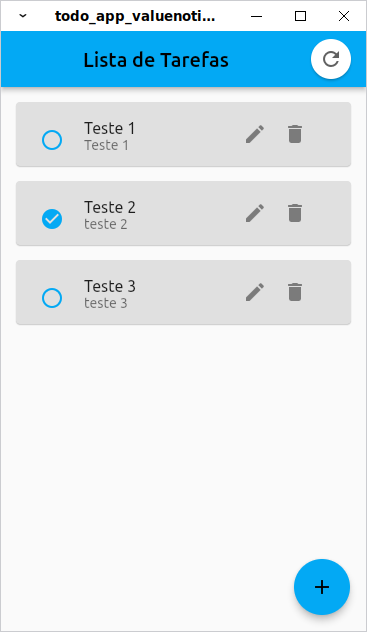
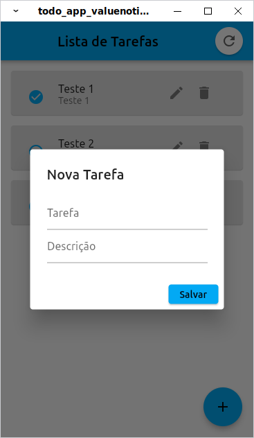
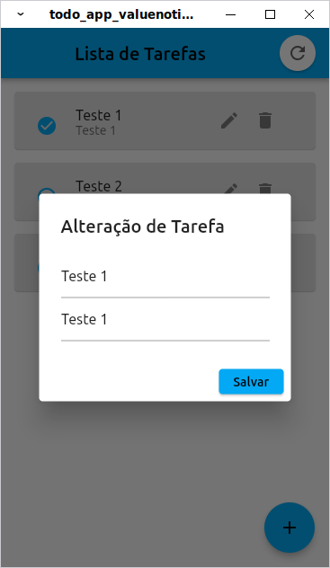

# Projeto Todo App (Flutter/Dart)

O App foi construído usando reatividade ValueNotifier e Dartion RESTful mini web server para simulação de API externa.

## Telas Construídas

### - Listagem de Tarefas criadas
 

 

### - Criação de uma nova tarefa
 

 

### - Edição de Tarefas
 

 
